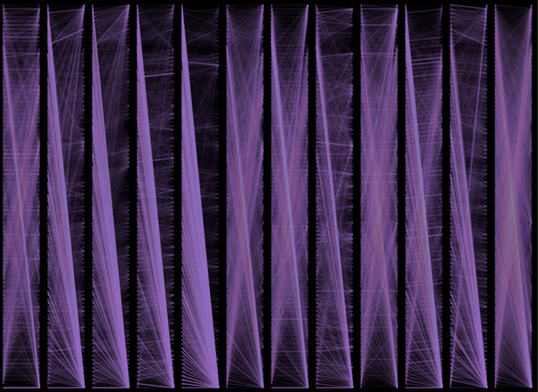
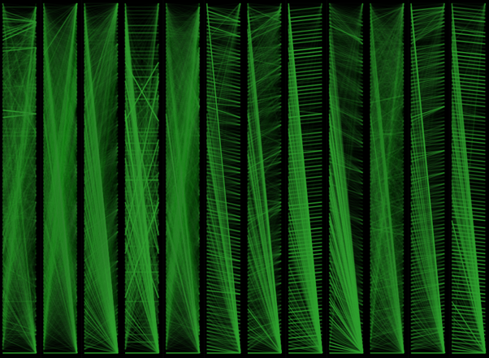
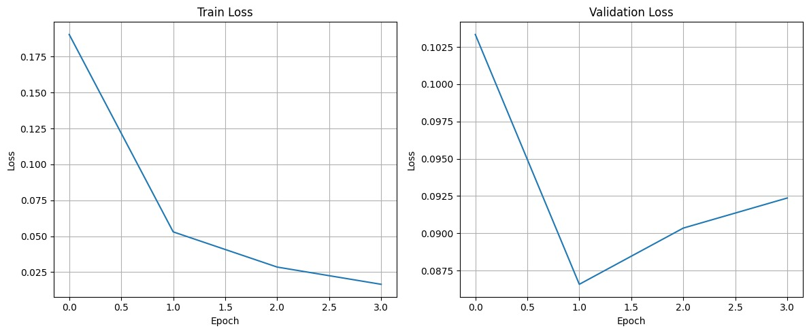
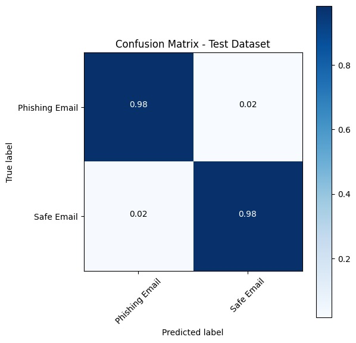
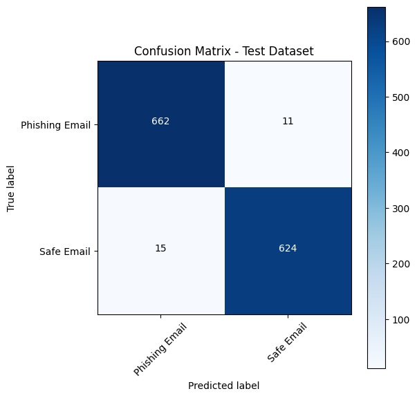

# Bert-Based E-mail Classifier

## Final project for Technion's ECE Deep Learning course (046211)

Gal Granot: [LinkedIn](https://www.linkedin.com/in/gal-granot/), [GitHub](https://github.com/GalGranot)

Nir Tevet: [LinkedIn](https://www.linkedin.com/in/nir-tevet-355b28229/), [GitHub](https://github.com/nirtevet)

## Introduction
This repository contains for an email proccessing Transformer, based on the Bidirectional Encoder Representations from Transformers (BERT) language model. The model, based on the attention architecture, attempts to classify legitimate emails from malicious phishing attempts, and can be used as an additional layer of protection against these types of attacks.

This project was written as part of the [Technion's ECE Deep Learning course (046211)](https://taldatech.github.io/ee046211-deep-learning/).

We've used [this Kaggle database](https://www.kaggle.com/datasets/naserabdullahalam/phishing-email-dataset) as a baseline for performance - it contains 82k emails with roughly equal amounts of legitimate and phishing/spam emails.

## Background and Results

 Our model achieved an accuracy rate of 98% on the test dataset, in addition to highlighting critical words that contributed to the model’s decision-making process. We've also visualized the attention mechanism using [BertViz](https://github.com/jessevig/bertviz).

### Attention visualization:

### Training & Validation Loss:

  

## Confusion Matrices:

  

## How to run

FIXME add code example

## Performance
add FIXME:
1. confusion matrix
2. val/train/test results
3. graphs

## File Overview

| Directory | File | Usage |
|-----------|------|---------|
| . | README.md | this file
| . | requirements.txt | pip install requirements file | 
| . | Phishing_Email.csv | Kaggle email database |
| research | project.ipynb | notebook interface for running project |
| research | project_raw.ipynb | our process of developing the project |
| src | utils.py | APIs for classifying and preprocessing emails |

## Steps to Set Up the Project

### Installation Commands From Command Line

| Step                      | Command                                                |
|---------------------------|--------------------------------------------------------|
| Install `torchdata`        | `pip install torchdata`                                |
| Install `portalocker`      | `pip install portalocker`                              |
| Install `kaggle`           | `pip install kaggle`                                   |
| Set up `kaggle.json`       | `mkdir -p ~/.kaggle`   `cp kaggle.json ~/.kaggle/`   `chmod 600 ~/.kaggle/kaggle.json` |
| Download dataset           | `kaggle datasets download -d subhajournal/phishingemails` |
| Install `bertviz`          | `pip install bertviz`                                  |
| Install `jupyterlab`      | `pip install jupyterlab`                               |
| Install `ipywidgets`      | `pip install ipywidgets`                               |
| Unzip dataset              | `unzip /content/phishingemails.zip`                    |

## Libraries and Versions

| Library                                    | Version   |
|--------------------------------------------|-----------|
| `numpy`                                    | `1.25.0`  |
| `pandas`                                   | `2.1.0`   |
| `matplotlib`                               | `3.7.2`   |
| `torch`                                    | `2.0.1`   |
| `scikit-learn`                             | `1.2.2`   |
| `transformers`                             | `4.31.0`  |
| `torchtext`                                | `0.16.0`  |
| `bertviz`                                  | `1.4.0`   |

FIXME:

- sources
- report

- A short video summarizing the project can be found here - FIXME

FIXME - maybe add highlighting important passages?

